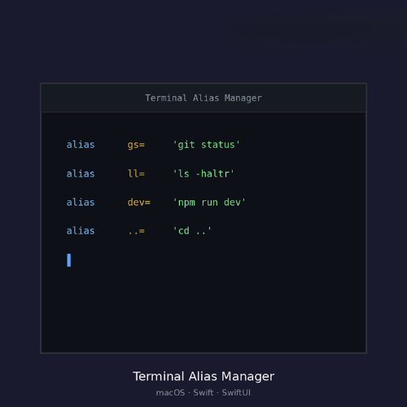

<div align="center">

# ⌨️ Terminal Alias Manager

**A native macOS app to visually manage your terminal aliases.**

No more manually editing `~/.zshrc` — add, edit, delete, and organize your shell aliases from a clean, native interface.

[](https://swift.org)
[](https://developer.apple.com/macos/)
[](https://developer.apple.com/xcode/swiftui/)
[](LICENSE)

</div>

---

## ✨ Features

| Feature | Description |
|---------|-------------|
| **Parse & List** | Automatically reads and parses aliases from `~/.zshrc` |
| **Add / Edit / Delete** | Full CRUD with validation and duplicate detection |
| **Enable / Disable** | Toggle aliases on or off without deleting them |
| **Search** | Instantly filter by alias name, command, or description |
| **Sort** | Sort by name, command, or status |
| **Duplicate** | Clone an existing alias with one click |
| **Auto Source** | Runs `source ~/.zshrc` after every change |
| **Backup** | Create timestamped backups of your `.zshrc` |
| **JSON Import / Export** | Share or migrate aliases between machines |
| **Copy to Clipboard** | Copy any command with a single click |
| **Context Menus** | Right-click actions on every alias |
| **Native UI** | Built with SwiftUI + NavigationSplitView (Finder-style layout) |

---

## 🖥️ Screenshots

<p align="center">
  
</p>

<p align="center">
  
</p>

<p align="center">
  
</p>

---

## 📋 Requirements

- **macOS 14.0** (Sonoma) or later
- **Xcode 15.2** or later
- **Swift 5.9**

---

## 🚀 Getting Started

### 1. Clone the repository

```bash
git clone https://github.com/efekurucay/terminal-alias-manager.git
cd terminal-alias-manager
```

### 2. Open in Xcode

```bash
open AliasManager.xcodeproj
```

### 3. Build & Run

Press **⌘R** in Xcode or run from the menu: **Product → Run**

The app will launch and automatically read your existing aliases from `~/.zshrc`.

---

## 🏗️ Architecture

The project follows the **MVVM** (Model-View-ViewModel) pattern:

```
AliasManager/
├── AliasManagerApp.swift           ← App entry point & window config
├── AliasManager.entitlements       ← File access permissions
├── Assets.xcassets/                ← App icon & accent color
│
├── Models/
│   └── AliasItem.swift             ← Alias data model
│
├── Services/
│   └── ZshrcService.swift          ← Read/write/parse ~/.zshrc
│
├── ViewModels/
│   └── AliasViewModel.swift        ← Business logic, search, CRUD
│
└── Views/
    ├── ContentView.swift           ← Main screen (NavigationSplitView)
    ├── AliasRowView.swift          ← Sidebar list row
    ├── AliasDetailView.swift       ← Detail panel (right side)
    └── AliasFormView.swift         ← Add / Edit form (sheet)
```

### Key Design Decisions

- **Sandbox disabled** — The app needs direct access to `~/.zshrc` in the user's home directory. App Sandbox is turned off in the entitlements file.
- **Non-alias lines preserved** — When saving, the service only modifies the managed alias block. All other `.zshrc` content (exports, PATH, plugins, etc.) is left untouched.
- **Managed block** — Aliases are written under a clearly marked `# Aliases (Managed by AliasManager)` section for easy identification.

---

## ⌨️ Keyboard Shortcuts

| Shortcut | Action |
|----------|--------|
| `⌘N` | Add new alias |
| `⌘R` | Refresh alias list |
| `Esc` | Cancel / dismiss form |

---

## 🔧 How It Works

1. **On launch**, the app reads `~/.zshrc` and parses all lines matching the `alias name='command'` pattern
2. Commented-out aliases (`# alias name='command'`) are detected as **disabled**
3. Comments directly above an alias line are captured as **descriptions**
4. When you make changes, the app:
   - Rewrites only the alias block in `~/.zshrc`
   - Runs `source ~/.zshrc` to apply changes immediately
   - All non-alias content in your `.zshrc` stays intact

---

## 📦 Import / Export

**Export** your aliases as a JSON file to back them up or share across machines:

```json
[
  {
    "id": "...",
    "name": "gs",
    "command": "git status",
    "isEnabled": true,
    "comment": "Quick git status"
  }
]
```

**Import** a JSON file to merge aliases into your current set. Duplicates (by name) are automatically skipped.

---

## 🤝 Contributing

Contributions are welcome! Here's how:

1. Fork the repository
2. Create your feature branch (`git checkout -b feature/amazing-feature`)
3. Commit your changes (`git commit -m 'Add amazing feature'`)
4. Push to the branch (`git push origin feature/amazing-feature`)
5. Open a Pull Request

### Ideas for Contribution

- [ ] App icon design
- [ ] Dark/light theme customization
- [ ] Support for `.bashrc` and `.bash_profile`
- [ ] Drag & drop reordering
- [ ] Alias categories / tags
- [ ] Menu bar quick-access widget
- [ ] Homebrew formula

---

## 📄 License

This project is licensed under the MIT License — see the [LICENSE](LICENSE) file for details.

---

<div align="center">

Built with ❤️ using Swift & SwiftUI

[Report Bug](https://github.com/efekurucay/terminal-alias-manager/issues) · [Request Feature](https://github.com/efekurucay/terminal-alias-manager/issues)

</div>
